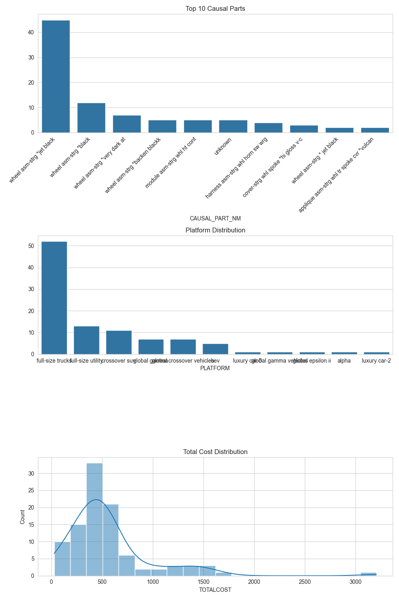

### Task 2 Report

**1. Column Analysis**

A detailed column-wise analysis was performed on the dataset. The dataset consists of 52 columns and 100 rows, containing vehicle repair data. Key columns include `VIN`, `CUSTOMER_VERBATIM`, `CORRECTION_VERBATIM`, `CAUSAL_PART_NM`, `PLATFORM`, and `TOTALCOST`. Several columns with low variance or a high percentage of missing values were identified, such as `CAMPAIGN_NBR`, `COMPLAINT_CD_CSI`, and `COMPLAINT_CD`.

**2. Data Cleaning Summary**

The following data cleaning steps were performed:

*   **Dropped Columns:** The `CAMPAIGN_NBR` column was dropped as it contained 100% missing values.
*   **Missing Value Imputation:**
    *   Categorical columns with missing values were filled with the string "Unknown".
    *   Numerical columns with missing values were filled with the mean of the respective column.
*   **Standardization:** All categorical (object type) columns were converted to lowercase to ensure consistency.

**3. Visualizations**

The following visualizations were generated to highlight key insights from the data:

*   **Top 10 Causal Parts:** This bar plot shows the most frequently failing parts.
    
*   **Platform Distribution:** This bar plot shows the distribution of vehicle platforms in the dataset.
    
*   **Total Cost Distribution:** This histogram shows the distribution of repair costs.
    

**4. Generated Tags & Key Takeaways**

Meaningful tags were generated from the `CUSTOMER_VERBATIM` and `CORRECTION_VERBATIM` columns to summarize the complaints and corrections. The following tags were created:

*   `peeling`: For issues related to parts peeling or coming apart.
*   `inoperative`: for components that are not working.
*   `noise`: For complaints about noise, rattles, or squeaks.
*   `warning_light`: For issues related to warning lights on the dashboard.
*   `replacement`: When a part was replaced.
*   `reprogram`: When a module was reprogrammed.
*   `other`: For all other cases.

**Key Takeaways:**

*   The most frequent causal part is "wheel asm-strg *jet black". This suggests a potential quality issue with this specific part.
*   The "full-size trucks" platform has the highest number of repairs in this dataset.
*   The total cost of repairs is skewed to the right, with a few expensive repairs.

**Actionable Recommendations:**

*   **Investigate the "wheel asm-strg *jet black":** The high frequency of this part as a causal part warrants an investigation into its quality and manufacturing process.
*   **Focus on Full-Size Trucks:** The high number of repairs for this platform suggests that a focused quality improvement initiative for full-size trucks could have a significant impact.
*   **Analyze High-Cost Repairs:** The high-cost repairs should be analyzed in more detail to identify the root causes and potential cost-saving measures.

**Discrepancies in the dataset:**

*   **Missing Values:** The dataset contained a significant number of missing values, especially in columns like `CAMPAIGN_NBR`, `ENGINE_SOURCE_PLANT`, and `TRANSMISSION_SOURCE_PLANT`. These were handled by dropping the column or imputing the values.
*   **Lack of Primary Key:** While `VIN` is unique for each vehicle, `TRANSACTION_ID` is not unique for each transaction. A unique primary key for each transaction would be beneficial for more granular analysis.
